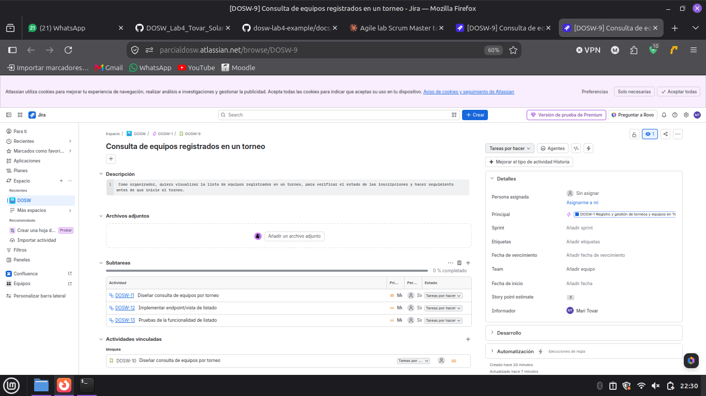

# 📄 Planeación del Sistema en Jira

## Desglose de trabajo: Épicas, Historias de Usuario y Tareas

## 1. Épica:

**DOSW-1 — Registro y gestión de torneos y equipos en TechCup**

## 2. Historias de usuario:

### HU-01 — Creación de torneo (DOSW-14)

### HU-02 — Registro e inscripción de equipo (DOSW-15)

### HU-03 — ID: DOSW-9
**Consulta de equipos registrados en un torneo**

Como organizador, quiero visualizar la lista de equipos registrados en un torneo, para verificar el estado de las inscripciones y hacer seguimiento antes de que inicie el torneo.

### HU-04 — ID: DOSW-2
**Validación de pago de inscripción**

## 3. Tareas:

### Tareas de HU-03 — ID: DOSW-9
### DOSW-16 — Diseñar modelo de datos del torneo

### DOSW-17 — Implementar creación y cambio de estado

### DOSW-18 — Validar regla de torneo único activo

### DOSW-19 — Diseñar flujo de registro de equipo

### DOSW-20 — Implementar registro de equipo

### DOSW-21 — Integrar pago de inscripción por PSE

**TR-07 — DOSW-11: Diseñar consulta de equipos por torneo**

Como desarrollador, quiero diseñar la lógica y estructura de datos para obtener los equipos asociados a un torneo, para tener una base sólida antes de implementar el endpoint.

**TR-08 — DOSW-12: Implementar endpoint/vista de listado**

Como desarrollador, quiero implementar el endpoint o vista que devuelve la lista de equipos registrados filtrados por torneo, para que el organizador pueda consultarlos desde la interfaz.

**TR-09 — DOSW-13: Pruebas de la funcionalidad de listado**

Como desarrollador, quiero probar la funcionalidad de listado con distintos escenarios (torneo con equipos, torneo vacío, acceso no autorizado), para garantizar que funcione correctamente antes de entregarla.

### Tareas de HU-04 -ID: DOSW-2

**TR-10 — DOSW-6: Diseñar el flujo de validación de pago**

**TR-11 — DOSW-7: Implementar cambio de estado del pago**

**TR-12 — DOSW-8: Implementar notificación de rechazo**

## 4. Cronograma:

## 5. Backlog:

